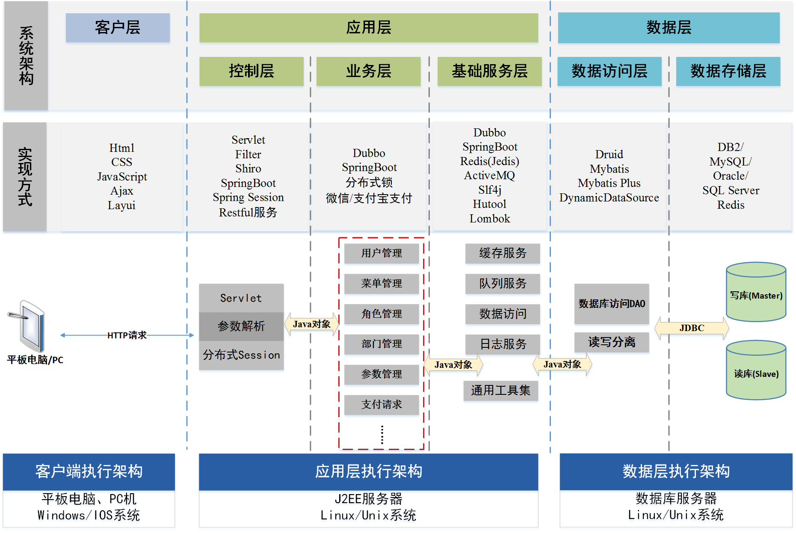
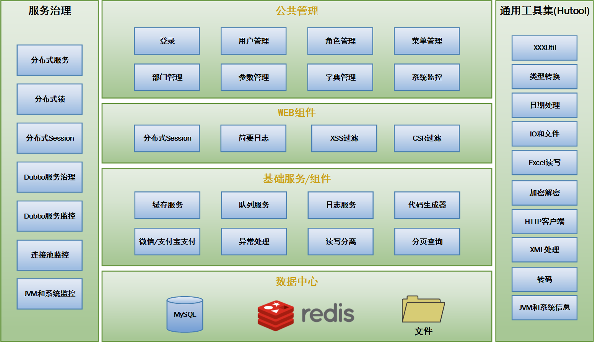
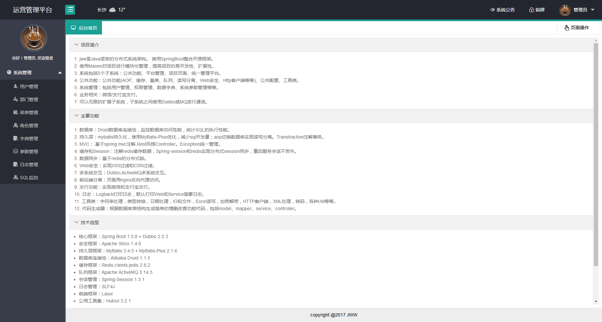
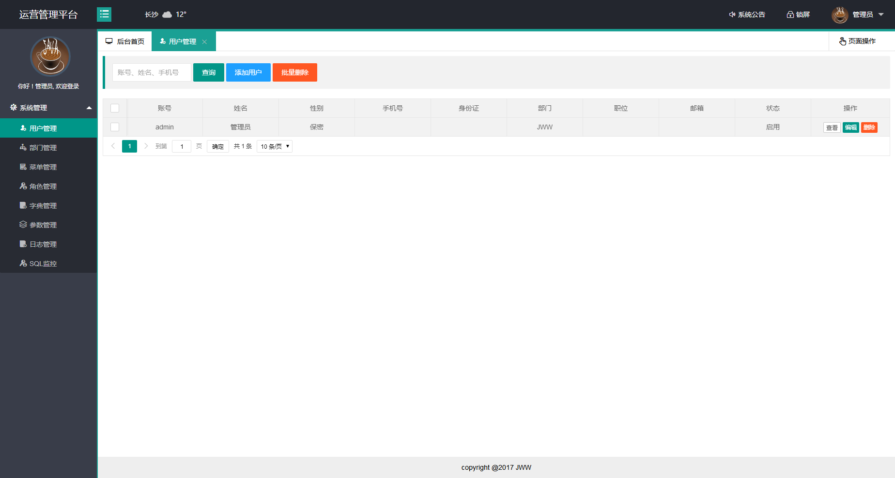
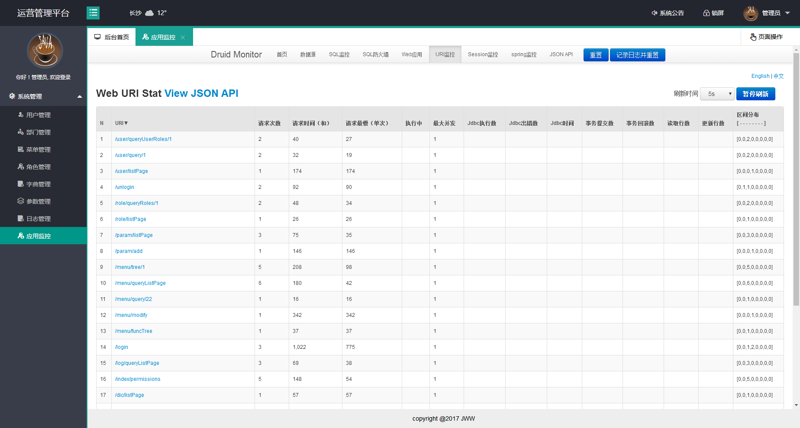
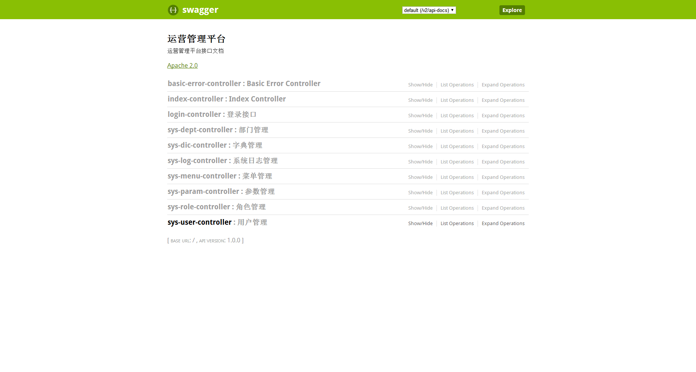

## JWW
交流QQ群：587535733

## 前言
**jww**以分布式基础架构为依托，包含但不仅限于分布式架构、基础框架、前端模板、代码生成、系统监测等功能，致力于为企业在蓬勃发展的业务及快速迭代开发领域提供全方位J2EE企业级技术规范及开发解决方案。

## 项目简介
- jww是Java语言的分布式系统架构。 使用SpringBoot整合开源框架。
- 系统包括5个子模块：公共功能、平台管理、项目页面、统一管理平台、项目说明。
- 公共功能：公共功能(基类、数据访问组件、读写分离、分布式session、HTTP客户端、日志服务、队列服务、支付服务组件、redis缓存、Web安全等等)、公共配置、工具类。
- 系统管理：包括用户管理、部门管理、菜单管理、角色管理、字典管理、参数管理、日志管理、应用监控等等。
- 业务相关：微信/支付宝支付。
- 系统通信：支持扩展子系统，子系统之间使用Dubbo或MQ进行通信。
- 演示平台使用Maven对项目进行模块化管理，提高项目的易开发性、扩展性。

## 主要功能
 1. 数据库：Druid数据库连接池，监控数据库访问性能，统计SQL的执行性能。 
 2. 持久层：mybatis持久化，使用MyBatis-Plus优化，减少sql开发量；aop切换数据库实现读写分离。Transtraction注解事务。
 3. MVC： 基于spring mvc注解,Rest风格Controller。Exception统一管理。
 4. 缓存和Session：注解redis缓存数据，Spring-session和redis实现分布式session同步，重启服务会话不丢失。
 5. 数据同步：基于redis的分布式锁。
 6. Web安全：实现XSS过滤和CSR过滤。
 7. 多系统交互：Dubbo,ActiveMQ多系统交互。
 8. 前后端分离：前端使用ajax访问后端的rest服务，后端返回json格式数据。页面用nginx反向代理访问。
 9. 支付功能：实现微信和支付宝支付客户端。
 10. 日志：Logback打印日志，默认打印Web和Service简要日志。
 11. 工具类：字符串处理，类型转换，日期处理，IO和文件，Excel读写，加密解密，HTTP客户端，XML处理，转码，各种Util等等。
 12. 代码生成器：根据数据库表结构生成简单的增删改查功能代码，包括model、mapper、service、controller。

## 技术选型
    ● 核心框架：Spring Boot 1.5.12.RELEASE + Dubbo 2.5.7
    ● 分布式协调服务：ZooKeeper 3.4.11
    ● 校验框架：Hibernate Validator 5.3.5.Final
    ● 安全框架：Apache Shiro 1.4.0
    ● 代码生成：MyBatis Plus Generator 2.1.6
    ● 持久层框架：MyBatis 3.4.5 + MyBatis-Plus 2.1.6
    ● 数据库连接池：Alibaba Druid 1.1.9
    ● 缓存框架：Redis.clients:jedis 2.8.2
    ● 队列框架：Apache ActiveMQ 5.14.5
    ● 会话管理：Spring-Session 1.3.1
    ● 日志管理：SLF4J 
    ● 前端框架：Layui 2.2.45
    ● 公用工具集：Hutool 3.2.3
    ● 支付组件：Egan pay-java-parent 2.0.7
    ● 代码简化：Lombok 1.16.20
    ● 序列化框架：Alibaba Fastjson 1.2.41
    ● HTTP客户端：Hutool-http 4.0.10
    ● 接口测试框架：Swagger2
    ● 字体图标：Alibaba Iconfont
    ● JWT：jsonwebtoken 0.9.0
    

## 项目结构 
```
jww
├─jww-common 公共模块
│  ├─jww-common-core 核心组件
│  ├─jww-common-db 数据访问组件
│  ├─jww-common-mdb 多数据源组件
│  ├─jww-common-dsession 分布式session
│  ├─jww-common-http HTTP客户端
│  ├─jww-common-jwt JWT组件
│  ├─jww-common-log 日志服务
│  ├─jww-common-mq 队列服务
│  ├─jww-common-oss 对象储存组件
│  ├─jww-common-pay 支付宝/微信支付组件
│  ├─jww-common-redis 缓存服务
│  ├─jww-common-ship 快递服务组件
│  └─jww-common-web WEB组件
│ 
├─jww-ui 页面模块
│  └─jww-ui-ump 统一管理平台页面
│ 
├─jww-ump 统一管理平台项目
│  ├─jww-ump-common 项目公共组件
│  ├─jww-ump-dao 项目数据访问模块
│  ├─jww-ump-generator 项目代码生成器
│  ├─jww-ump-model 项目MODEL模块
│  ├─jww-ump-mq 项目队列模块
│  ├─jww-ump-rpc-api 项目接口模块
│  ├─jww-ump-rpc-service 项目后台模块
│  ├─jww-ump-server 项目前台控制模块
│  └─sqls 项目SQL语句
``` 

## 核心技术图



## 基础架构图



## 本地部署

  1. 环境要求
   * JDK1.8+
   * MySQL5.5+
   * Maven3.3+
   * Zookeeper3.3+
   * Redis3.0+
   * Nginx1.8+
   * Apache Activemq-5.0+ (可选)
 2.	执行SQL文件jww/jww-ump/sqls/jww.sql，初始化库、表和数据；
 3.	修改jww/jww-ump/jww-ump-rpc-service/src/main/resources/application-dev.yml，更新MySQL帐号密码，Redis的IP、端口和密码,Zookeeper的地址；
 4. 修改jww/jww-ump/jww-ump-server/src/main/resources/application-dev.yml，更新Redis的IP、端口和密码,Zookeeper的地址；
 5.	修改Nginx/conf/nginx.conf，指定静态和动态页面地址（参考附件）；
 6.	启动MySQL, Zookeeper, Redis, Nginx;
 7. IntelliJ IDEA 菜单File-Settings-Plugins，添加lombok plugin插件
 8. IntelliJ IDEA中右键 >> Run jww/jww-ump/jww-ump-rpc-service/src/main/java/com/jww/ump/rpc/service/ServiceApplication.java;
 9. IntelliJ IDEA中右键 >> Run jww/jww-ump/jww-ump-server/src/main/java/com/jww/ump/server/ServerApplication.java;
 10. 访问地址：http://localhost 帐户密码：admin/123456
 11. swagger地址：http://localhost:8089/swagger-ui.html

    
## 预览图






    
## 版权声明
jww使用 [Apache License 2.0][] 协议.

[Apache License 2.0]: http://www.apache.org/licenses/LICENSE-2.0
